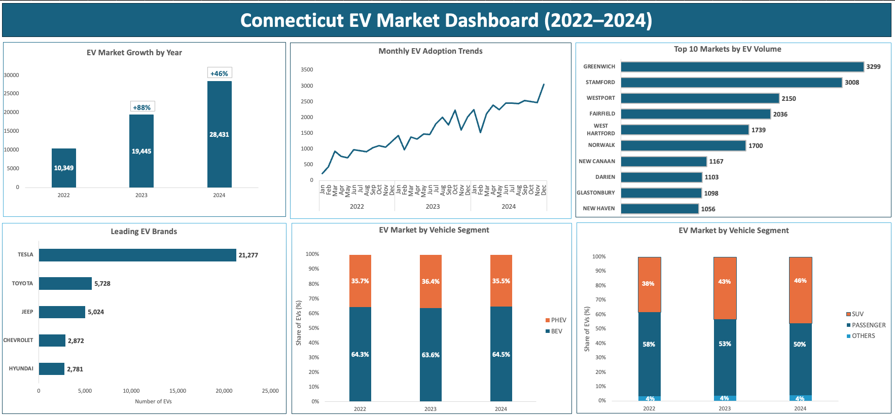

# Connecticut Electric Vehicle Market Analysis (2022-2024)  

## Project Background  
The Connecticut Open Data Portal maintains a comprehensive dataset on electric vehicle registrations across the state from 2022–2024.  

With Connecticut’s goal of having 500,000 EVs on the road by 2030 and growing EV infrastructure investments, this previously underutilized registration data provides critical insights for strategic planning across multiple stakeholder groups. This project thoroughly analyzes and synthesizes over 60,000 registration records to uncover actionable insights that will improve commercial success and investment decisions across Connecticut’s evolving EV ecosystem.  

Insights and recommendations are provided in the following key areas:  
- **Market Growth Analysis:** Evaluation of adoption trajectory and demand patterns  
- **Geographic Investment Strategy:** Evaluation of high-concentration areas for infrastructure and market development  
- **Competitive Landscape Assessment:** Analysis of brand share and market positioning opportunities  
- **Consumer Technology Trends:** Understanding shifts in vehicle segments and electrification preferences  

## Data Structure Overview  
The registration dataset contains comprehensive EV adoption data with key business dimensions, including registration volume, competitive landscape (make, model, manufacturer), technology adoption (BEV vs. PHEV classification), and market segmentation (vehicle types and geographic distribution by towns).  

Before starting the analysis, the raw dataset was thoroughly standardized, including mapping over 100 location variants to official town names and normalizing inconsistent manufacturer and model designations.  

## Executive Summary  

#### Overview of Findings  
Connecticut's EV market expanded from 10,349 vehicles in 2022 to 28,431 in 2024, nearly tripling in just 24 months. Growth moderated from 88% in 2023 to 46% in 2024 as the market matured. Geographic adoption is heavily concentrated in affluent Fairfield County towns. Tesla maintains a 37% market share despite growing competition, and consumer preference is decisively shifting toward electric SUVs, which grew from 38% to 46% market share over the same period.  

*Below is the overview dashboard showing key performance trends*  

## In-Depth Analysis  

#### Growth Trajectory  
The Connecticut EV market increased 175% over the 24-month period, with consistent monthly growth showing no demand disruptions. While year-over-year growth rates moderated from 88% in 2023 to 46% in 2024, overall EV registration volumes continued climbing. This pattern reflects a healthy market maturation rather than declining consumer demand.  

#### Geographic Concentration  
Fairfield County dominates Connecticut's EV landscape, with an extreme concentration in affluent towns. The top 10 towns represent nearly one-third of the statewide EV market, seven of which are located in Fairfield County. This clustering correlates with median household incomes exceeding $100,000 and proximity to the New York metro area.  

- **Greenwich:** 3,299 vehicles (6% of state total)  
- **Stamford:** 3,008 vehicles (5%)  

Together, these two towns alone account for nearly 11% of Connecticut's entire EV fleet.  

#### Competitive Landscape  
Tesla maintains 37% market share with 21,277 vehicles but faces rising competition from traditional manufacturers. Toyota is the closest competitor with 5,728 registrations (10% share), followed by Jeep at 5,024 vehicles (9% share). Chevrolet and Hyundai each hold approximately 5% market share.  

#### Consumer Preferences  
The electric SUV market expanded from 38% to 46% over 24 months, while passenger cars declined from 58% to 50%. This 8-percentage-point shift represents a fundamental change in EV buyer priorities toward larger family vehicles. Meanwhile, Battery Electric Vehicles consistently maintain a two-thirds market share, while Plug-in Hybrids hold steady at one-third —indicating that these technologies serve different consumer needs rather than directly competing.  

## Recommendations  

1. **Prioritize Infrastructure Deployment in Fairfield County and Nearby Areas**  
   Seven Fairfield County towns dominate the top 10 EV markets, representing over 15,000 vehicles, yet fast-charging infrastructure remains severely limited and primarily highway-based. For example, Greenwich, despite leading statewide adoption, has just one fast-charging station for non-Tesla owners. This highlights significant infrastructure gaps, making Fairfield County the top priority for fast-charger deployment to ensure maximum utilization and meet the needs of non-Tesla EVs.  

2. **Target High-Growth Suburban EV Markets**  
   Despite Tesla's 37% dominance, traditional manufacturers still maintain significant market presence. Dealers should focus on targeted marketing campaigns in Fairfield County, where consumers are seeking non-Tesla options. This approach will help build brand loyalty and capture additional market share growth through established dealer networks.  

3. **Capitalize on the Electric SUV Trend**  
   With SUV market share growing by 8 percentage points in 24 months, automakers should prioritize new electric SUV launches targeting family demographics. Dealers should also adjust inventory allocation to reduce wait times to prevent customers from shifting to alternatives.  

4. **Maintain PHEV Presence Amid EV Growth**  
   With PHEVs holding steady at ~35% market share, manufacturers should continue hybrid offerings rather than pursuing BEV-only strategies, as over one-third of Connecticut's EV market still prefers plug-in hybrid technology. PHEVs also address range-anxiety concerns and provide a practical bridge for consumers transitioning to fully electric vehicles. 

## Methodology and Assumptions  

- **Analysis Platform:** Microsoft Excel (Power Query, PivotTables, and integrated visualization tools)  
- **Key Assumptions:**  
  - Each registration represents one unique vehicle addition to Connecticut's EV fleet  
  - Analysis covers the entire EV market, including BEVs and PHEVs  

